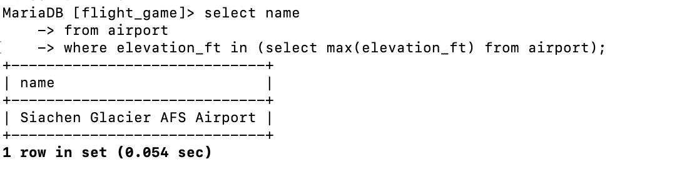

# question 1
select elevation_ft as "max(elevation_ft)"
from airport
where elevation_ft in (select max(elevation_ft) from airport);

# question 2 
select country.continent, count(*)
from country 
group by country.continent;

# question 3 
select screen_name, count(*)
from game, goal_reached
where game.id = goal_reached.game_id
group by screen_name;

# question 4 
select screen_name 
from game 
where game.co2_consumed in (select min(co2_consumed) from game
where game.location in (select ident from airport));

# question 5 
select country.name, count(*)
from country, airport
where country.iso_country = airport.iso_country
group by country.name 
order by count(*) desc;

# question 6 
select country.name
from country, airport
where country.iso_country = airport.iso_country
group by country.name
having count(*)>1000;
limit 50;

# question 7 
select name
from airport 
where elevation_ft in (select max(elevation_ft) from airport);

# question 8 
select name 
from country 
where country.iso_country in (select iso_country from airport
where airport.elevation_ft in (select max(elevation_ft) from airport));

# question 9 
select count(*)
from goal
where goal.id in (select goal_id from goal_reached
where game_id in (select game.id from game
where game.screen_name = "Vesa"));

# question 10
select name 
from airport 
where airport.latitude_deg in (select min(latitude_deg) from airport);
