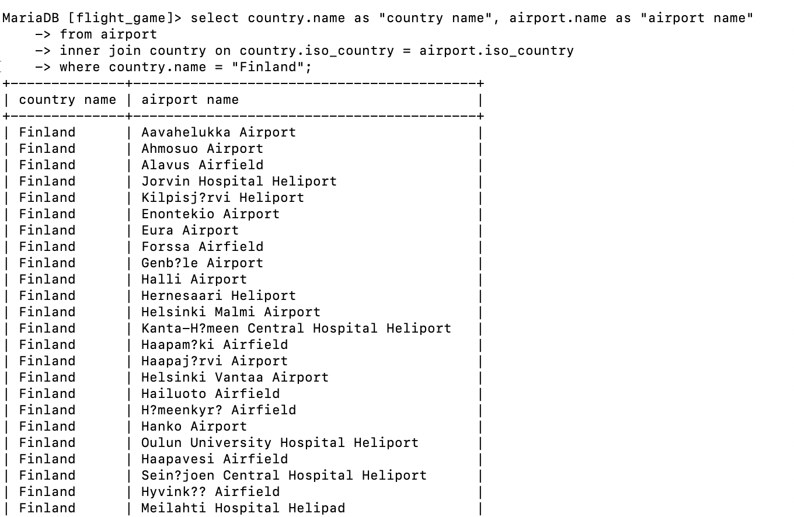
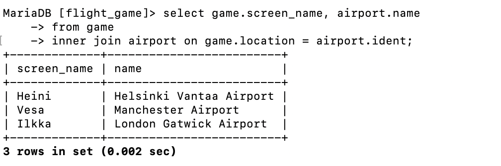
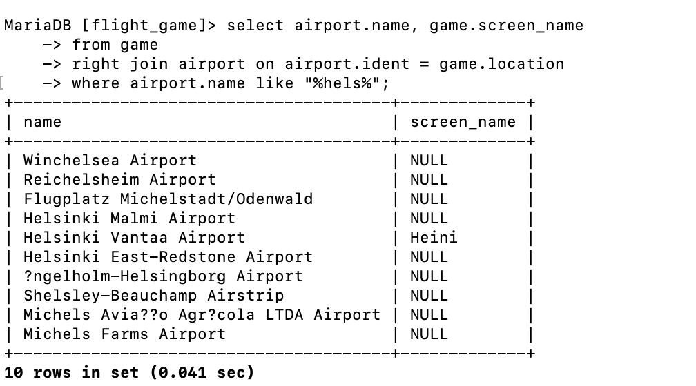
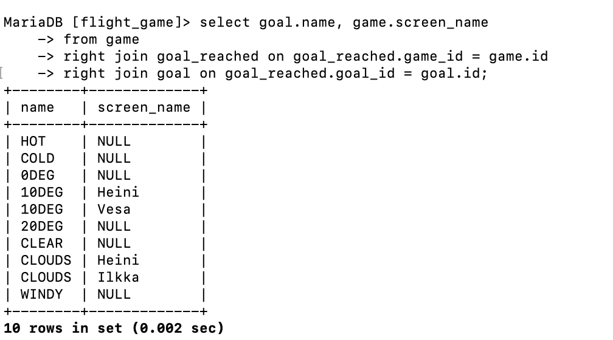

# question 1  
select country.name as "country name", airport.name as "airport name"
from airport
inner join country on country.iso_country = airport.iso_country
where country.name = "Finland";

# question 2  
select game.screen_name, airport.name 
from game 
inner join airport on game.location = airport.ident;

# question 3 
select game.screen_name, country.name 
from country
inner join airport on airport.iso_country = country.iso_country 
inner join game on airport.ident = game.location;

# question 4 
select airport.name, game.screen_name 
from game 
right join airport on airport.ident = game.location
where airport.name like "%hels%";

# question 5 
select goal.name, game.screen_name 
from game
right join goal_reached on goal_reached.game_id = game.id
right join goal on goal_reached.goal_id = goal.id;
