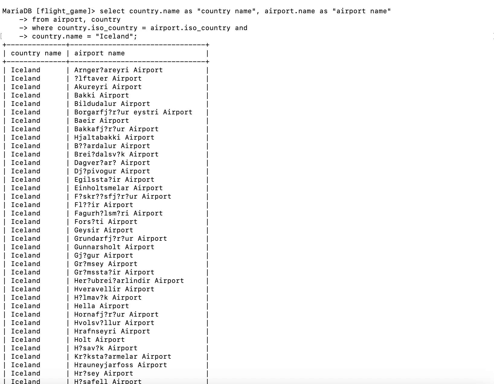
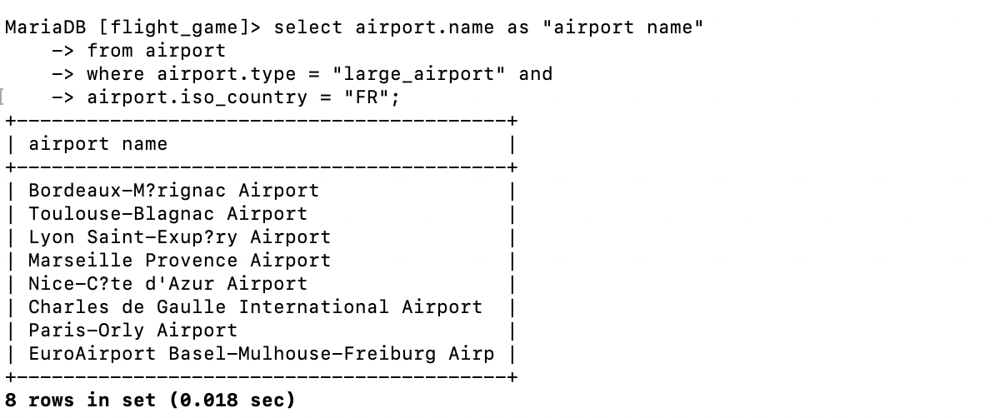
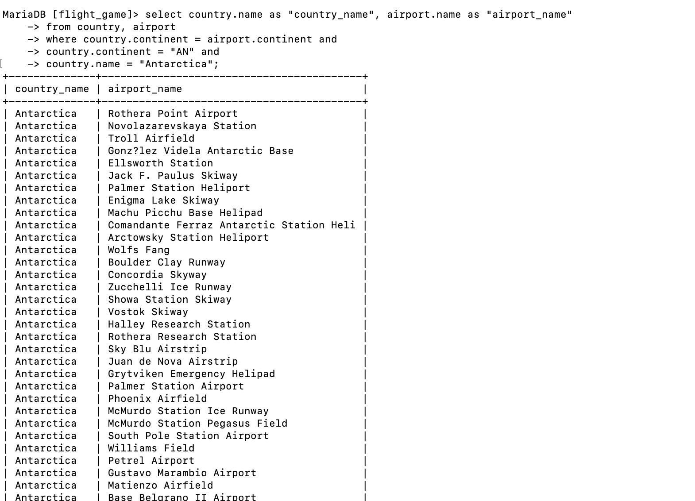
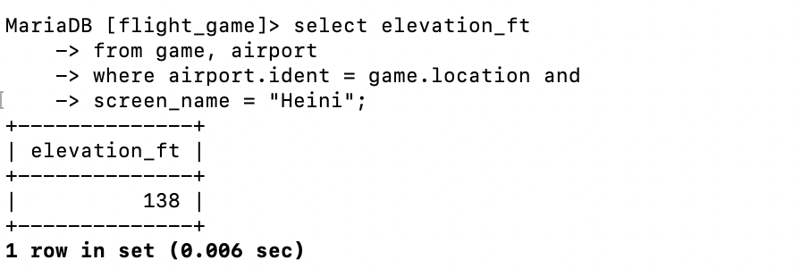
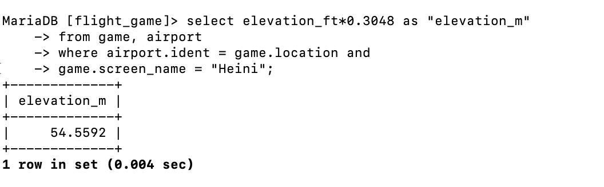
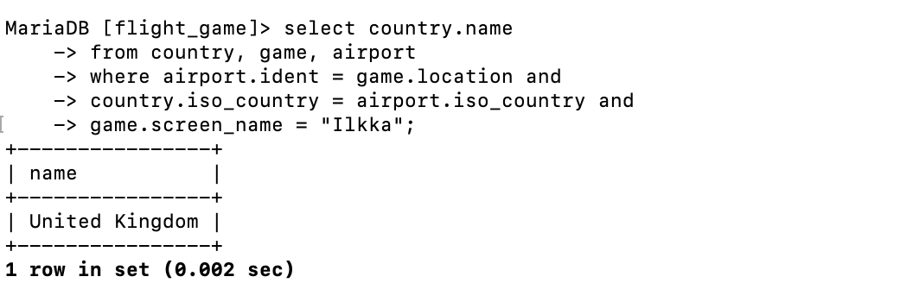
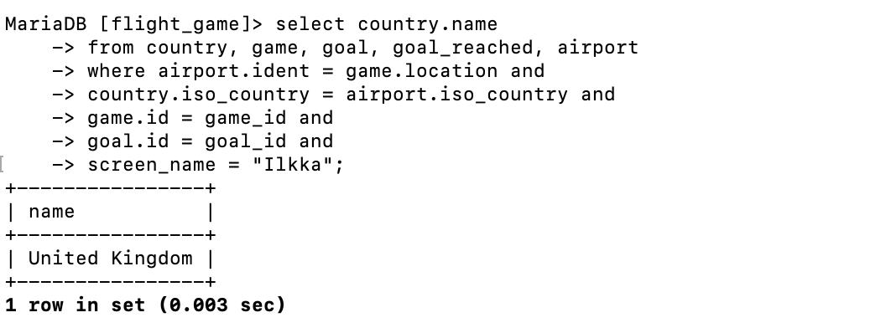

# question 1 
select country.name as "country name", airport.name as "airport name"
from airport, country 
where country.iso_country = airport.iso_country and 
country.name = "Iceland";

# question 2  
select airport.name as "airport name"
from airport
where airport.type = "large_airport" and
airport.iso_country = "FR";

# question 3 
select country.name as "country_name", airport.name as "airport_name"
from country, airport
where country.continent = airport.continent and 
country.continent = "AN" and 
country.name = "Antarctica";

# question 4 
select elevation_ft 
from game, airport 
where airport.ident = game.location and 
screen_name = "Heini";

# question 5 
select elevation_ft*0.3048 as "elevation_m"
from game, airport 
where airport.ident = game.location and 
game.screen_name = "Heini";

# question 6 
select airport.name 
from airport, game 
where airport.ident = game.location and 
screen_name = "Ilkka";

# question 7 
select country.name
from country, game, airport
where airport.ident = game.location and 
country.iso_country = airport.iso_country and 
game.screen_name = "Ilkka";

# question 8 
select goal.name 
from goal, game, goal_reached
where goal.id = goal_id and 
game.id = game_id and 
screen_name = "Heini";

# question 9 
select airport.name 
from airport, game, goal, goal_reached
where airport.ident = game.location and 
game.id = game_id and 
goal.id = goal_id and
screen_name = "Ilkka";

# question 10 
select country.name 
from country, game, goal, goal_reached, airport
where airport.ident = game.location and
country.iso_country = airport.iso_country and 
game.id = game_id and
goal.id = goal_id and
screen_name = "Ilkka";

