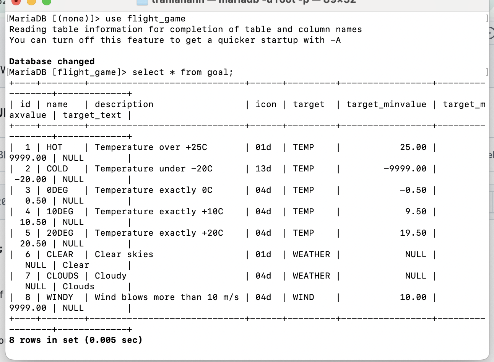
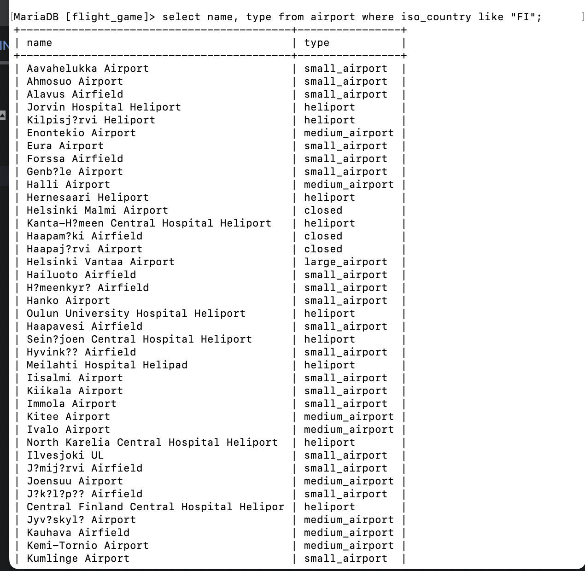
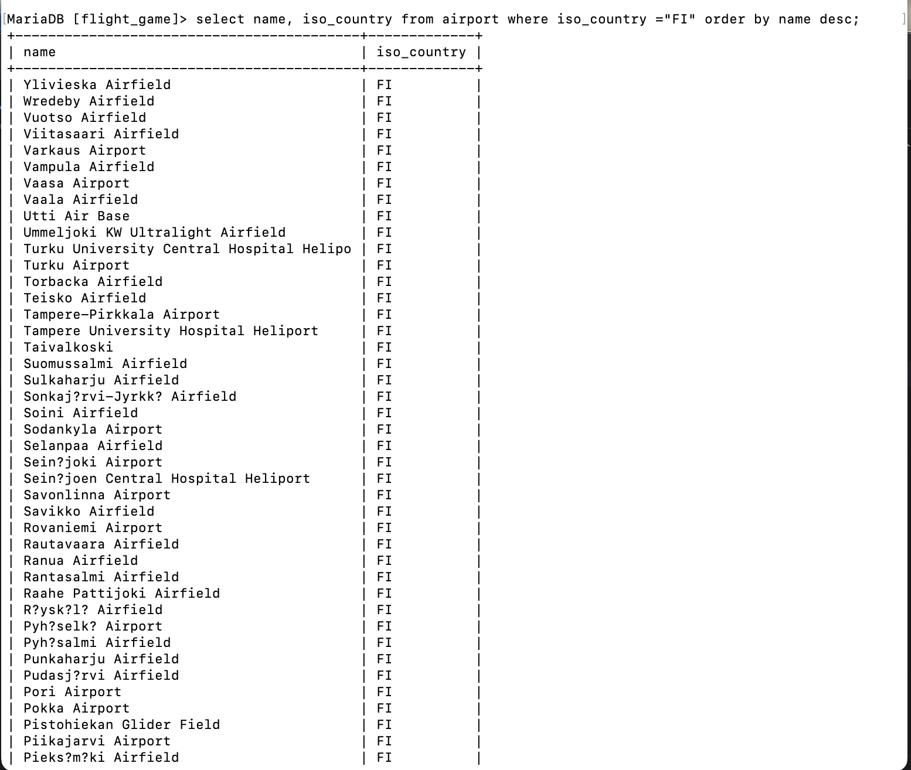
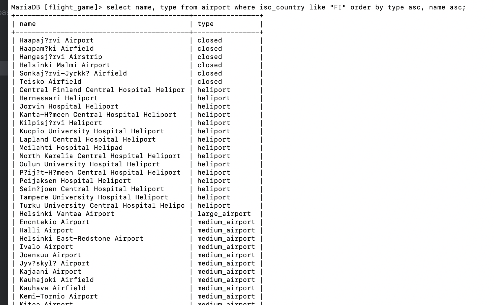
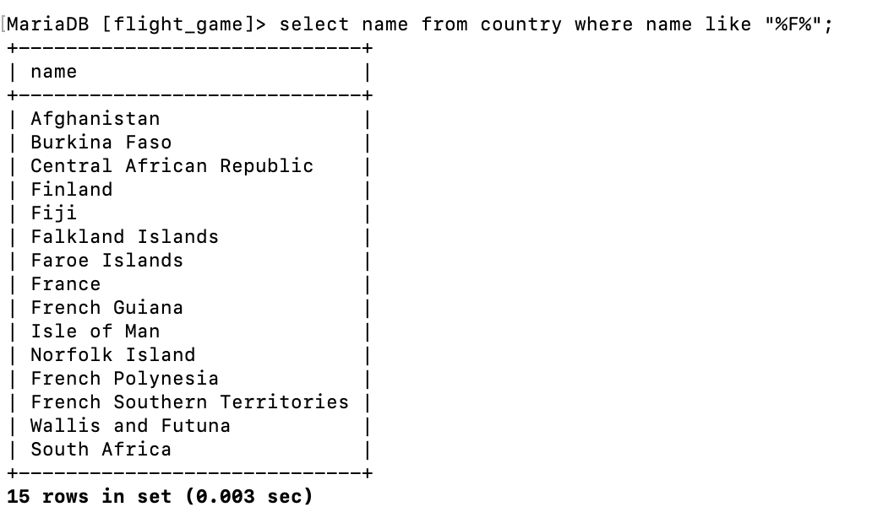
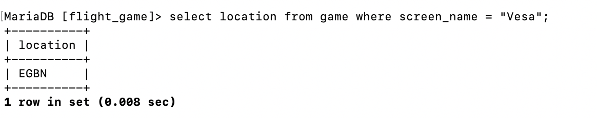
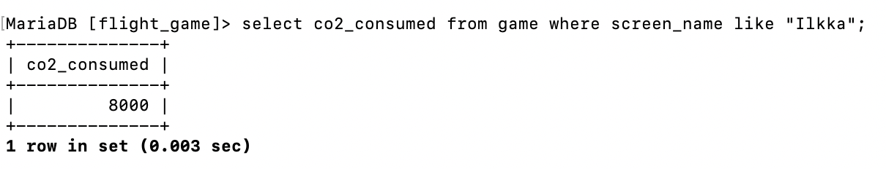
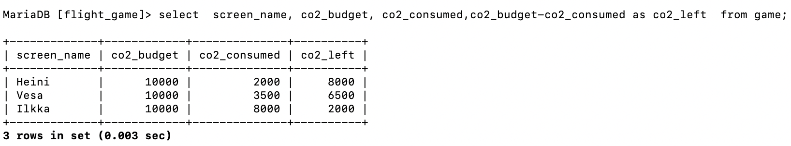

# question 1 
select * from goal;

# question 2
select name, type from airport where iso_country like "FI";

# question 3
select name, iso_country from airport where iso_country ="FI" order by name desc;

# question 4
select name, type from airport where iso_country like "FI" order by type asc, name asc;

# question 5 
select name from country where name like "F%";

# question 6
select name from country where name like "%F%";

# question 7 
select location from game where screen_name = "Vesa";

# question 8 
select co2_consumed from game where screen_name like "Ilkka";

# question 9 
select co2_budget from game limit 1;

# question 10
select  screen_name, co2_budget, co2_consumed,co2_budget-co2_consumed as co2_left  from game;

