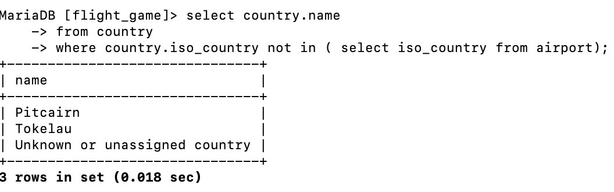

# question 1 
select country.name
from country
where country.iso_country in(
select iso_country from airport
where airport.name like "Satsuma%");

# question 2
select airport.name
from airport
where iso_country in (
select iso_country from country 
where country.name ="Monaco");
![screenshot]

# question 3 
select game.screen_name from game 
where game.id in (select game_id from goal_reached
where goal_id in (select goal.id from goal
where goal.name = "Clouds"));

# question 4
select country.name 
from country 
where country.iso_country not in ( select iso_country from airport);

# question 5 
select goal.name from goal 
where goal.id not in (select goal_id from goal_reached
where game_id not in (select game.id from game
where game.screen_name = "Heini"));
