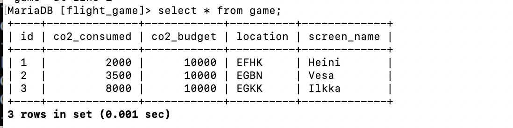

# question 1 
update game
set game.location = (select ident from airport
where airport.name = "Nottingham Airport");
update game
set co2_consumed = (co2_consumed +500)
where game.screen_name = "Vesa";

# question 2 
b. goal_reached

# question 3 
delete from goal_reached;

# question 4 
delete from game;
